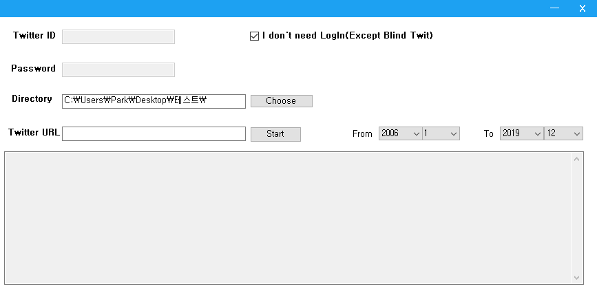

# TwitterMediaImageCrawler
Download here: https://github.com/AntarticPenguin/TwitterMediaImageCrawler/raw/master/DownloadCrawlerHere/DownloadCrawlerHere.zip

# TwitterMediaCrawler V1.0
이 프로그램은 트위터 미디어 탭에 있는 이미지를 크롤링하기 위한 프로그램입니다.  
This program crawls Twitter Media tab's images.

# TwitterMediaCrawler V1.1
이제 다운로드 도중에 창을 움직일 수 있습니다.  
You can move program's window while downloading.

프로그램을 실행시 마지막 위치에서 실행됩니다.  
Program open on last closed position.

버그 수정
간혹 다운로드 이미지 순서(오래된 트윗에서 최신순)가 안맞는 경우가 있었습니다. 이 부분을 수정하였습니다.  
- Sometimes download's order(oldest to newest) is wrong. Because of image's file size. Fixed it.

# TwitterMediaCrawler V2.0
UI를 수정했습니다.  
Change Program's UI.

기간 설정을 통하여 특정 기간의 트윗을 다운로드 할 수 있습니다.  
You can download a tweet about specific time period, setting the date range.

비 로그인기능을 추가하였습니다.  
Added Non-LogIn feature.

## Description
숨겨진 트윗 이미지를 다운로드 하기 위해서는 로그인이 필요합니다. 아이디 비밀번호는 저장되지 않습니다.  
Need to login for hidden twit's image about NSFW. Id, password not save.

반드시 URL에 트위터의 미디어 탭 주소를 넣어주세요. 다른 탭에서는 정상 작동하지 않을 수 있습니다.  
Must write Twitter media tab's URL. Maybe not properly work on other tabs.  

다운로드는 오래된 포스트에서 최신 포스트 순으로 다운됩니다.  
Download oldest post to newest post.

파일 다운로드가 시작되기 전까지 오픈된 크롬을 닫으면 안됩니다. 트위터의 컨텐츠 동적로딩 때문에 스크롤 다운을 통해 계속 트윗을 읽어오는 방식입니다.
Don't close opened chrome until start file download. Because of Twitter's dynamic contents loading.

## 피드백은 언제나 환영입니다.
## Feedback is always welcome.
